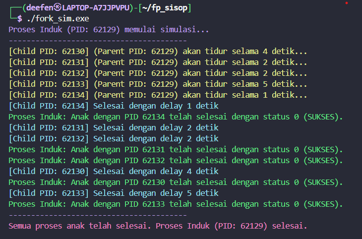

# Final Project Sistem Operasi IT

## Peraturan
1. Waktu pengerjaan dimulai hari Kamis (19 Juni 2025) setelah soal dibagikan hingga hari Rabu (25 Juni 2025) pukul 23.59 WIB.
2. Praktikan diharapkan membuat laporan penjelasan dan penyelesaian soal dalam bentuk Readme(github).
3. Format nama repository github “Sisop-FP-2025-IT-[Kelas][Kelompok]” (contoh:Sisop-FP-2025-IT-A01).
4. Setelah pengerjaan selesai, seluruh source code dan semua script bash, awk, dan file yang berisi cron job ditaruh di github masing - masing kelompok, dan link github dikumpulkan pada form yang disediakan. Pastikan github di setting ke publik.
5. Commit terakhir maksimal 10 menit setelah waktu pengerjaan berakhir. Jika melewati maka akan dinilai berdasarkan commit terakhir.
6. Jika tidak ada pengumuman perubahan soal oleh asisten, maka soal dianggap dapat diselesaikan.
7. Jika ditemukan soal yang tidak dapat diselesaikan, harap menuliskannya pada Readme beserta permasalahan yang ditemukan.
8. Praktikan tidak diperbolehkan menanyakan jawaban dari soal yang diberikan kepada asisten maupun praktikan dari kelompok lainnya.
9. Jika ditemukan indikasi kecurangan dalam bentuk apapun di pengerjaan soal final project, maka nilai dianggap 0.
10. Pengerjaan soal final project sesuai dengan modul yang telah diajarkan.

## Kelompok C01

Nama | NRP
--- | ---
Diva Aulia Rosa | 5027241003
Aditya Reza Daffansyah | 5027241034
Hanif Mawla Faizi | 5027241064
Nafis Faqih Allmuzaky Maolidi | 5027241095

## Deskripsi Soal
### Fork Wait Race
Buat program untuk simulasi fork dalam jumlah banyak dengan delay yang berbeda-beda untuk mengeluarkan sebuah print statement, sehingga muncul sebuah urutan berdasarkan delay masing-masing fork.

### Catatan

Struktur repository:
```
.
├── fork_sim.c   # File Utama
├── README.md           # Dokumentasi 

```

## Pengerjaan

**Teori**
Simulasi Fork dan Sinkronisasi Proses
## 1. Pendahuluan
Dalam sistem operasi modern, kemampuan menciptakan dan mengelola proses sangat penting. Sistem call seperti fork() di Unix/Linux memberikan kemampuan kepada sebuah program untuk membuat turunan proses secara paralel. Simulasi ini bertujuan untuk memahami bagaimana proses anak dapat berjalan dengan delay acak, serta bagaimana proses induk dapat menunggu dan mengelola proses anak tersebut menggunakan wait().

## 2. Konsep Dasar
### 2.1 Proses dan Sistem Call fork()
Proses merupakan entitas aktif yang memuat eksekusi program, termasuk register, stack, heap, dan state lainnya. Sistem call fork() digunakan untuk membuat salinan dari proses saat ini, menciptakan proses anak yang identik kecuali untuk PID-nya. Dalam praktiknya: proses induk menerima PID dari anak dan proses anak menerima nilai 0.
“fork() returns a 0 to the newly created child process and returns the child's process ID to the parent.” — Silberschatz et al., 2020

# 2.2 Konsep Delay dan Sleep
Setiap proses anak disimulasikan memiliki waktu eksekusi yang berbeda menggunakan fungsi sleep(). Fungsi ini menunda eksekusi proses selama sejumlah detik, yang dalam konteks ini disetel secara acak (rand() % 5 + 1), mencerminkan variasi beban kerja atau waktu tanggap proses dalam sistem nyata.

# 2.3 Sinkronisasi Proses dengan wait()
Proses induk harus memanggil wait() untuk: mengetahui kapan proses anak selesai dan menghindari zombie process (proses yang sudah selesai tapi belum diambil statusnya). Fungsi wait() akan memblokir proses induk hingga satu proses anak menyelesaikan eksekusinya, lalu mengembalikan PID-nya dan status keluarannya.

# 2.4 Penggunaan Warna Output (ANSI Escape Codes)
Untuk meningkatkan keterbacaan, pewarnaan digunakan melalui kode ANSI. Contoh warna: Biru (proses induk), Kuning (status delay anak), Cyan (anak selesai), Hijau (sukses), Merah (error). Ini membantu debugging visual dan pelacakan log pada sistem real-time.

## 3. Implementasi Simulasi
# 3.1 Struktur Program
Program utama menciptakan NUM_FORKS proses anak. Proses anak memiliki delay acak dan akan keluar setelah delay.

# 3.2 Alur Eksekusi
1. Proses induk memulai simulasi dan menyiapkan seed acak.
2. Proses induk membuat 5 anak menggunakan fork().
3. Setiap anak tidur dengan delay acak dan keluar dengan exit().
4. Proses induk menunggu semua anak selesai menggunakan wait().
4. Analisis dan Relevansi
Simulasi ini menggambarkan prinsip dasar multiprogramming, asynchronous execution, dan proses sinkronisasi dalam OS. Penggunaan delay dan wait() memungkinkan kita melihat perbedaan urutan selesai antar proses. Hal ini berkaitan erat dengan scheduling, CPU resource sharing, dan proses lifecycle.
5. Kesimpulan
Melalui simulasi ini, kita memahami secara praktis cara kerja fork() dalam menciptakan proses anak, bagaimana delay mempengaruhi urutan eksekusi, serta bagaimana wait() menjaga keteraturan dan mencegah zombie process. Simulasi ini penting sebagai dasar untuk memahami konsep lanjutan seperti exec(), signal handling, dan inter-process communication (IPC).
6. Daftar Pustaka
Silberschatz, A., Galvin, P. B., & Gagne, G. (2020). Operating System Concepts (10th ed.). Wiley.
Tanenbaum, A. S., & Bos, H. (2015). Modern Operating Systems (4th ed.). Pearson.
Kerrisk, M. (2010). The Linux Programming Interface: A Linux and UNIX System Programming Handbook. No Starch Press.
Robbins, K. A., & Robbins, S. (2003). Unix Systems Programming: Communication, Concurrency and Threads. Prentice Hall.
Bach, M. J. (1986). The Design of the UNIX Operating System. Prentice-Hall.
Stallings, W. (2018). Operating Systems: Internals and Design Principles (9th ed.). Pearson.
Love, R. (2010). Linux System Programming (2nd ed.). O’Reilly Media.
ANSI. (1986). American National Standard for Information Systems — Programming Language C (ANSI X3.159-1989).

...

**Solusi**

- Inisialisasi dan Setup
  Mendefinisikan jumlah fork dan warna untuk output terminal. Seed random akan diinisialisasi di proses induk.
  ```
  #define NUM_FORKS 5
  #define COLOR_RESET   "\x1b[0m"
  #define COLOR_RED     "\x1b[31m"
  #define COLOR_GREEN   "\x1b[32m"
  #define COLOR_YELLOW  "\x1b[33m"
  #define COLOR_BLUE    "\x1b[34m"
  #define COLOR_MAGENTA "\x1b[35m"
  #define COLOR_CYAN    "\x1b[36m"

  srand(time(NULL)); 
  printf(COLOR_BLUE "Proses Induk (PID: %d) memulai simulasi...\n" COLOR_RESET, getpid());
  ```
  
- Membuat Child Process
  Parent process akan menjalankan loop untuk membuat proses anak sebanyak `NUM_FORKS`. Setiap fork menghasilkan proses anak baru. Jika eror maka akan ada error mesagge.
  ```
  for (int i = 0; i < NUM_FORKS; i++) {
        pid = fork();
        if (pid == -1) {
            perror(COLOR_RED "Fork failed" COLOR_RESET);
            exit(EXIT_FAILURE);
        } else if (pid == 0) {
            ...
        }
    }
  ```

- Random Sleep dan Keluar pada Child Process
  Setiap child process akan mengatur seed random dengan `getpid()`, menentukan delay acak 1 - 5 detik, sleep selama delay tersebut, dan mengeluarkan status sukses.
  ```
  srand(getpid());
            int delay_time = rand() % 5 + 1; 

            printf(COLOR_YELLOW "[Child PID: %d] (Parent PID: %d) akan tidur selama %d detik...\n" COLOR_RESET, getpid(), getppid(), delay_time);
            sleep(delay_time);
            printf(COLOR_CYAN "[Child PID: %d] Selesai dengan delay %d detik\n" COLOR_RESET, getpid(), delay_time);
            exit(EXIT_SUCCESS); 
  ```

- Parent Process Akan Menunggu Setiap Child Process
  Parent Process akan menunggu setiap anak selesai, satu per satu, dan mencetak status keluar masing-masing.
  ```
  for (int i = 0; i < NUM_FORKS; i++) {
        pid_t child_pid = wait(&status); 
        if (child_pid == -1) {
            perror(COLOR_RED "wait failed" COLOR_RESET); 
            exit(EXIT_FAILURE);
        }
        if (WIFEXITED(status) && WEXITSTATUS(status) == EXIT_SUCCESS) {
            printf(COLOR_GREEN "Proses Induk: Anak dengan PID %d telah selesai dengan status %d (SUKSES).\n" COLOR_RESET, child_pid, WEXITSTATUS(status));
        } else {
            printf(COLOR_RED "Proses Induk: Anak dengan PID %d selesai dengan status %d (GAGAL).\n" COLOR_RESET, child_pid, WEXITSTATUS(status));
        }
    }
  ```

- Cara Compile dan Run Program
  - Compile :
    `gcc fork_sim.cpp -o fork_simu.exe`

  - Run :
    `./fork_sim`


  

**Video Menjalankan Program**

[Klik di sini untuk melihat video menjalankan program](assets/DEMO_PROGRAM_FORK_SIMULATION.mp4)


**Gambar Output Program**




## Daftar Pustaka

Sitasi 1
Sitasi 2
Sitasi 3
